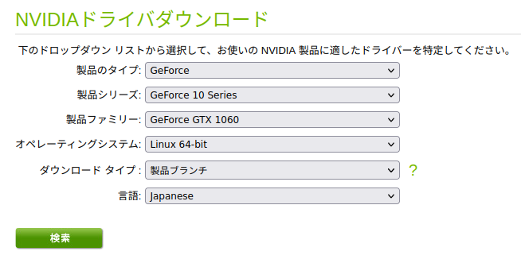
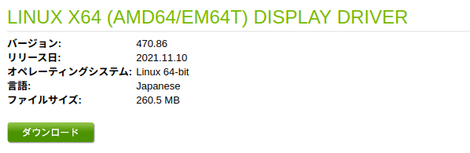
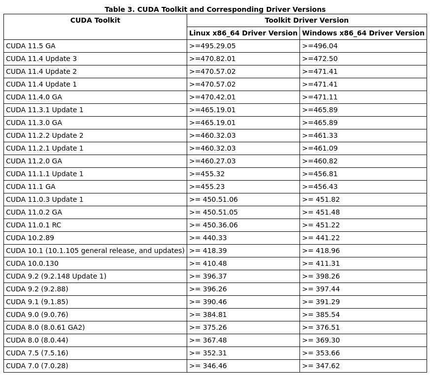
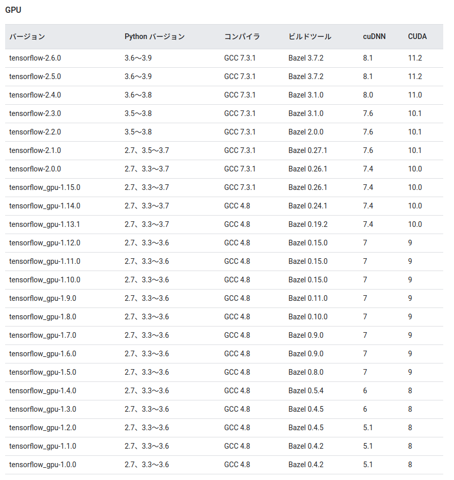
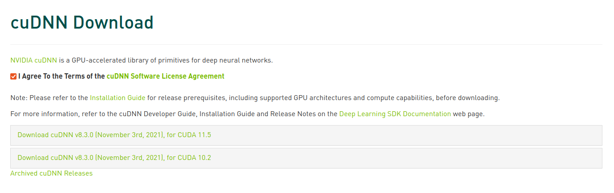
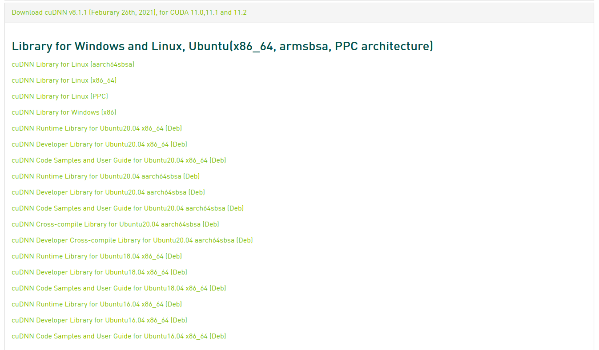
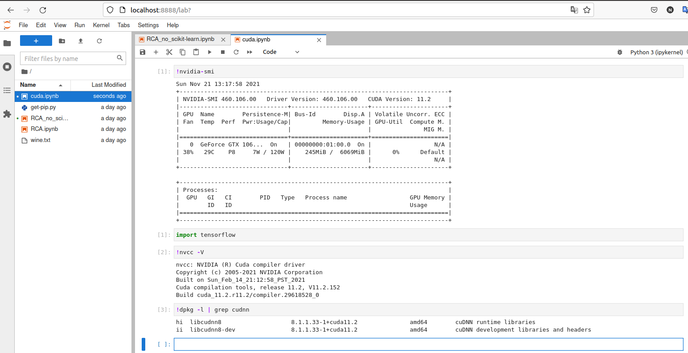
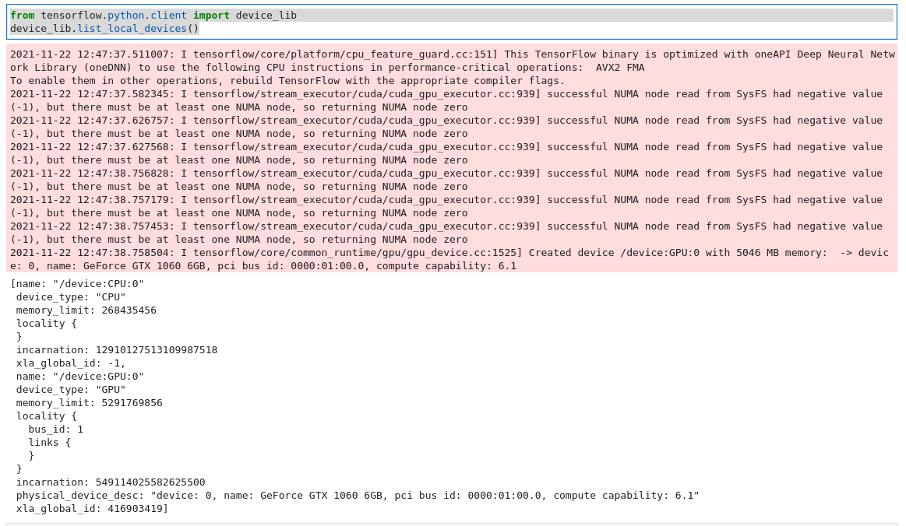

# Ubuntu 20.04 Docker 上で NVIDIA cuda + Cudnn + Jupyter Notebook を立ち上げる

[TOC]


## 目的

Ubuntu上で機械学習を学ぶための環境を作った際のメモ。

DockerコンテナでJupyter Notebookを立ち上げて、GPUが使えるようにする。

NVIDIA公式のCUDAがインストールされたDockerイメージを元にして、コンテナを作成する。


## 機材

Intel® Core™ i5-7500 CPU @ 3.40GHz × 4

NVIDIA Corporation GP106 [GeForce GTX 1060 6GB]

Ubuntu 20.04.3 LTS 64bit


## 参照

[Ubuntu 20.04 Install Tensorflow GPU Version (NVIDIA GTX-1060)](https://www.programmerall.com/article/39692037606/)

[【Docker】GPU が使える Jupyter Notebook 環境を最速で用意する](https://qiita.com/kaijism/items/ada49192df0a6d285c3a)

[NvidiaドライバとCUDAとcuDNNとTensorflow-gpuとPythonのバージョンの対応](https://qiita.com/konzo_/items/a6f2e8818e5e8fcdb896)


## NVIDIA Driver / CUDA / cuDNN のバージョンを調べる

```bash
$ ubuntu-drivers devices
WARNING:root:_pkg_get_support nvidia-driver-390: package has invalid Support Legacyheader, cannot determine support level
== /sys/devices/pci0000:00/0000:00:01.0/0000:01:00.0 ==
modalias : pci:v000010DEd00001C03sv00001462sd00008C94bc03sc00i00
vendor   : NVIDIA Corporation
model    : GP106 [GeForce GTX 1060 6GB]
driver   : nvidia-driver-418-server - distro non-free
driver   : nvidia-driver-460 - third-party non-free
driver   : nvidia-driver-470-server - distro non-free
driver   : nvidia-driver-470 - third-party non-free
driver   : nvidia-driver-455 - third-party non-free
driver   : nvidia-driver-465 - third-party non-free
driver   : nvidia-driver-495 - third-party non-free recommended
driver   : nvidia-driver-460-server - distro non-free
driver   : nvidia-driver-390 - distro non-free
driver   : nvidia-driver-450-server - distro non-free
driver   : nvidia-driver-450 - third-party non-free
driver   : xserver-xorg-video-nouveau - distro free builtin
```

これで、GPUモデル、どのドライバーが使えるかわかる。ただし、最新が良いわけではなく、CUDAとの相性があるので要注意。


### 自分のGPUに対応するドライバーをチェック

https://www.nvidia.co.jp/Download/index.aspx?lang=jp





どうやら、バージョン470が良さそう。（ここが落とし穴だったので注意)


### GPUドライバーとCUDAの関係をチェック

https://docs.nvidia.com/cuda/cuda-toolkit-release-notes/index.html



ドライバーによってCUDAのバージョンが異なることがわかる。470だったらCUDA11.4、460だったらCUDA11.2になる。


### CUDAとcuDNNとtensorflow-GPUのバージョンを確認する

https://qiita.com/konzo_/items/a6f2e8818e5e8fcdb896



ここでCUDAのバージョンが11.2までしかないことがわかる。**よって、GPUドライバーは460になる。**cuDNNのバージョンは8.1。


### インストールバージョンのまとめ

------

1. NVIDIA Driver : nvidia-driver-460
2. CUDA version : 11.2
3. cuDNN version : 8.1

------


## NVIDIA Driver をインストールする

````bash
$ sudo apt install nvidia-driver-460
````

NVIDIAのドライバーは3rd Party扱いのため、そのまま立ち上げるとデフォルトのドライバーが読み込まれてしまう。インストール中にセキュア・ブートで使用される鍵および証明書を作るか聞いてくるので、作る。パスワードは適当に決めてよいが、再起動中にパスワードの前から何番目の文字を入れろ、という支持が3回あるので間違えないようにすること。ちょっと実情と違うが参考URLは[こちら](https://phst.hateblo.jp/entry/2020/02/12/000000)。

```bash
$ sudo reboot
```

ブルーな画面が出て来るのでなにかキーを押す。その後はMokをエンロールする。よくわからないけど。

```
Enroll MOK ->
Continue ->
Yes ->
パスワード ->
Reboot ->
```

これで無事にドライバーが立ち上がっているはず。失敗するとデュアル画面にならなくなるのですぐわかる。

ドライバーが入っているかは、こちらで確認。

```
$ nvidia-smi
Mon Nov 22 19:57:00 2021       
+-----------------------------------------------------------------------------+
| NVIDIA-SMI 460.106.00   Driver Version: 460.106.00   CUDA Version: 11.2     |
|-------------------------------+----------------------+----------------------+
| GPU  Name        Persistence-M| Bus-Id        Disp.A | Volatile Uncorr. ECC |
| Fan  Temp  Perf  Pwr:Usage/Cap|         Memory-Usage | GPU-Util  Compute M. |
|                               |                      |               MIG M. |
|===============================+======================+======================|
|   0  GeForce GTX 106...  On   | 00000000:01:00.0  On |                  N/A |
| 38%   33C    P0    28W / 120W |    275MiB /  6069MiB |      0%      Default |
|                               |                      |                  N/A |
+-------------------------------+----------------------+----------------------+
                                                                               
+-----------------------------------------------------------------------------+
| Processes:                                                                  |
|  GPU   GI   CI        PID   Type   Process name                  GPU Memory |
|        ID   ID                                                   Usage      |
|=============================================================================|
|    0   N/A  N/A      1106      G   /usr/lib/xorg/Xorg                 59MiB |
|    0   N/A  N/A      1808      G   /usr/lib/xorg/Xorg                102MiB |
|    0   N/A  N/A      1944      G   /usr/bin/gnome-shell               91MiB |
|    0   N/A  N/A      4696      G   /usr/lib/firefox/firefox            1MiB |
|    0   N/A  N/A      4909      G   /usr/lib/firefox/firefox            1MiB |
|    0   N/A  N/A      5091      G   /usr/lib/firefox/firefox            1MiB |
|    0   N/A  N/A      5172      G   /usr/lib/firefox/firefox            1MiB |
|    0   N/A  N/A      5947      G   /usr/lib/firefox/firefox            1MiB |
|    0   N/A  N/A      6457      G   /usr/lib/firefox/firefox            1MiB |
+-----------------------------------------------------------------------------+
```


## CUDAをインストールする(ここは不要かも)

バージョン指定は不要で、以下のコマンドを打つと自動的に相性のあっているものがインストールされる。

```bash
$ sudo apt install nvidia-cuda-toolkit
```

インストールバージョンを確認する。

```bash
$ nvcc -V
nvcc: NVIDIA (R) Cuda compiler driver
Copyright (c) 2005-2019 NVIDIA Corporation
Built on Sun_Jul_28_19:07:16_PDT_2019
Cuda compilation tools, release 10.1, V10.1.243
```


## cuDNNのインストール

こちらを参照した。https://qiita.com/konzo_/items/3e2d1d7480f7ef632603

公式サイトhttps://developer.nvidia.com/cudnn にログイン(会員登録が必要)して、同意するにチェックを入れると最新バージョンが表示される。

画面下にアーカイブ(Archived cuDNN Releases)があるので、そちらをクリック。





以下をダウンロード。

libcudnn8_8.1.1.33-1+cuda11.2_amd64.deb

libcudnn8-dev_8.1.1.33-1+cuda11.2_amd64.deb

libcudnn8-samples_8.1.1.33-1+cuda11.2_amd64.deb

以下の順番でインストール。この順番で入れないとうまくいかないらしい。

```bash
$ sudo dpkg -i libcudnn8_8.1.1.33-1+cuda11.2_amd64.deb
$ sudo dpkg -i libcudnn8-dev_8.1.1.33-1+cuda11.2_amd64.deb
$ sudo dpkg -i libcudnn8-samples_8.1.1.33-1+cuda11.2_amd64.deb
```

cudnnのインストールを確認する

```bash
$ dpkg -l | grep cudnn 
ii  libcudnn8                                  8.1.1.33-1+cuda11.2                   amd64        cuDNN runtime libraries
ii  libcudnn8-dev                              8.1.1.33-1+cuda11.2                   amd64        cuDNN development libraries and headers
ii  libcudnn8-samples                          8.1.1.33-1+cuda11.2                   amd64        cuDNN documents and samples
```

OK。


## Docker イメージとコンテナを準備する

参照元：https://qiita.com/kaijism/items/ada49192df0a6d285c3a

- nvidia/cuda:11.2.2-cudnn8-devel-ubuntu20.04 : NVIDIA 公式Docker イメージ
- my-nvidia-cuda : NVIDIA 公式の Docker イメージを元に、今回新規作成するイメージ（pip パッケージの追加などを行う）
- jupyter-cuda : 今回作成するイメージから起動するコンテナ

Dockerfileを準備するディレクトリの構造は以下。

```
$ tree my*
my-nvidia-cuda
├── Dockerfile
└── requirements.txt
```

Dockerfile

```dockerfile
FROM nvidia/cuda:11.2.2-cudnn8-devel-ubuntu20.04

COPY ./requirements.txt /tmp
WORKDIR /code

RUN apt-get update && apt-get -y upgrade
RUN apt install -y curl python3 python3-distutils
RUN curl https://bootstrap.pypa.io/get-pip.py -o get-pip.py && python3 get-pip.py

RUN pip install -r /tmp/requirements.txt
```

requirements.txt

```requirement.txt
jupyter
jupyterlab
numpy
pandas
matplotlib
scikit-learn
scikit-image
scipy
torch
torchvision
tqdm
albumentations
tensorflow-gpu
Pillow
opencv-python
```

「my-nvidia-cuda」の名前で Docker イメージをビルド。warningが出るが気にしない。

```bash
$ cd my-nvidia-cuda
$ docker build . -t my-nvidia-cuda
```

生成されたイメージでGPUが使えることを確認する。通ればイメージは無事にできていると想定できる。

```
$ sudo docker run --rm --gpus all my-nvidia-cuda nvidia-smi
Sun Nov 21 10:06:37 2021       
+-----------------------------------------------------------------------------+
| NVIDIA-SMI 460.106.00   Driver Version: 460.106.00   CUDA Version: 11.2     |
|-------------------------------+----------------------+----------------------+
| GPU  Name        Persistence-M| Bus-Id        Disp.A | Volatile Uncorr. ECC |
| Fan  Temp  Perf  Pwr:Usage/Cap|         Memory-Usage | GPU-Util  Compute M. |
|                               |                      |               MIG M. |
|===============================+======================+======================|
|   0  GeForce GTX 106...  On   | 00000000:01:00.0  On |                  N/A |
| 38%   33C    P8     8W / 120W |    275MiB /  6069MiB |      1%      Default |
|                               |                      |                  N/A |
+-------------------------------+----------------------+----------------------+
                                                                               
+-----------------------------------------------------------------------------+
| Processes:                                                                  |
|  GPU   GI   CI        PID   Type   Process name                  GPU Memory |
|        ID   ID                                                   Usage      |
|=============================================================================|
+-----------------------------------------------------------------------------+
```


## Dockerコンテナの起動

コンテナは永続的に使うものではない、という記載があるが、個人の開発環境なのでなんども使うことを想定する

```
$ docker run -it -v /home/ryotaro/Documents/Python:/home/python --gpus all --name jupyter-cuda -p 8888:8888 my-nvidia-cuda sh -c 'jupyter-lab --allow-root --ip=*'
```

先ほどGPUが使えることを確認したときの --rm はなくす。これがあるとコンテナが一時的なものになる。

「--gpus all」オプションをつけて GPU を使えるようにする。

「sh -c 'jupyter-lab ....」オプションで jupyter-lab が立ち上がるようにする。

コンテナの名前は「--name jupyter-cuda」で指定。

ローカルホストでjupyter notebookにアクセスするポートを8888と指定している。

上記コマンドのあとの画面表示サンプルは以下。

```
[I 2021-11-22 13:52:59.254 ServerApp] jupyterlab | extension was successfully linked.
[I 2021-11-22 13:52:59.265 ServerApp] Writing Jupyter server cookie secret to /root/.local/share/jupyter/runtime/jupyter_cookie_secret
[I 2021-11-22 13:52:59.500 ServerApp] nbclassic | extension was successfully linked.
[W 2021-11-22 13:52:59.533 ServerApp] WARNING: The Jupyter server is listening on all IP addresses and not using encryption. This is not recommended.
[I 2021-11-22 13:52:59.538 ServerApp] nbclassic | extension was successfully loaded.
[I 2021-11-22 13:52:59.539 LabApp] JupyterLab extension loaded from /usr/local/lib/python3.8/dist-packages/jupyterlab
[I 2021-11-22 13:52:59.539 LabApp] JupyterLab application directory is /usr/local/share/jupyter/lab
[I 2021-11-22 13:52:59.543 ServerApp] jupyterlab | extension was successfully loaded.
[I 2021-11-22 13:52:59.543 ServerApp] Serving notebooks from local directory: /code
[I 2021-11-22 13:52:59.543 ServerApp] Jupyter Server 1.11.2 is running at:
[I 2021-11-22 13:52:59.543 ServerApp] http://fbe4d7f71402:8888/lab?token=c5149ebfa5f55439c7d8ecb70894cf7af0c040dacbbbab54
[I 2021-11-22 13:52:59.543 ServerApp]  or http://127.0.0.1:8888/lab?token=c5149ebfa5f55439c7d8ecb70894cf7af0c040dacbbbab54
[I 2021-11-22 13:52:59.544 ServerApp] Use Control-C to stop this server and shut down all kernels (twice to skip confirmation).
[W 2021-11-22 13:52:59.547 ServerApp] No web browser found: could not locate runnable browser.
[C 2021-11-22 13:52:59.547 ServerApp] 
    
    To access the server, open this file in a browser:
        file:///root/.local/share/jupyter/runtime/jpserver-9-open.html
    Or copy and paste one of these URLs:
        http://fbe4d7f71402:8888/lab?token=c5149ebfa5f55439c7d8ecb70894cf7af0c040dacbbbab54
     or http://127.0.0.1:8888/lab?token=c5149ebfa5f55439c7d8ecb70894cf7af0c040dacbbbab54
```

ここの最後で出ているtokenがjupyter notebookのログイン時に必要になる。

忘れてしまったら以下で確認できる。

```bash
$ docker logs jupyter-cuda
```


## コンテナの起動、シャットダウン、内部へのアクセス

docker run 直後だとコマンドを受け付けないので、別のターミナルを起動する。

シャットダウンするには

```bash
$ docker stop jupyter-cuda
```

再び起動させるには

```bash
$ docker start jupyter-cuda
```

内部へアクセスするには docker start 後に

```bash
$ docker exec -i -t jupyter-cuda bash
root@7e9e74aaa9ff:/code# 
```

となる。内部は別のubuntuになっていると考えればわかりやすい。


## Jupyter Notebook へアクセス

DockerによりJupyter notebookのローカルサーバーが立ち上がっている状態なの、

```url
localhost:8888/
```

でアクセスできる。最初はTokenを聞かれるので、初回のDockerコンテナ起動時に表示されるTokenを記入すればOK。

ここで、NVIDIAのドライバー等、再確認する。Linuxコマンドは「!」を頭に付ける。



CUDAとcuDNNはローカルのUbuntu環境ではなさそう。なので、GPUのドライバーだけ入れてあれば、あとは環境を汚さずインストールできたかも。

さらに tensorflow-gpu の確認。

```python
from tensorflow.python.client import device_lib
device_lib.list_local_devices()
```



ここでTensorflowがGPUを認識していないとCPUしか出てこない。今回はGPUも出ているのでインストールできた。


## 使わなかった情報

GPGキーの取得

$ distribution=$(. /etc/os-release;echo $ID$VERSION_ID) \
   && curl -s -L https://nvidia.github.io/nvidia-docker/gpgkey | sudo apt-key add - \
   && curl -s -L https://nvidia.github.io/nvidia-docker/$distribution/nvidia-docker.list | sudo tee /etc/apt/sources.list.d/nvidia-docker.list

$ sudo apt-get update
$ sudo apt-get install -y nvidia-docker2
$ sudo systemctl restart docker

nvidia/cuda:11.2.2-cudnn8-devel-ubuntu20.04　の代わりになる様子。
